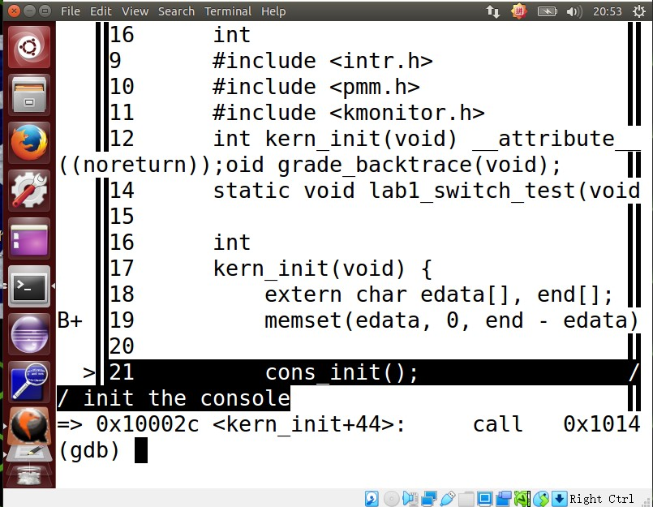
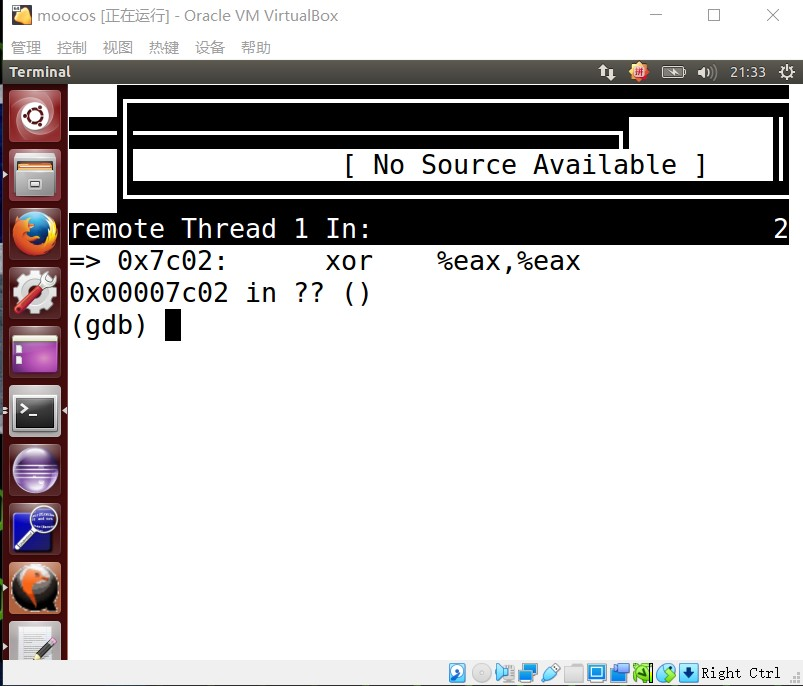

#练习2
***
##1.使用qemu调试make文件
在进入lab1文件夹之后，使用命令 make debug 进入调试模式。

在查看了tools文件夹中的gdbinit文件之后，可以看到存在代码
	
	target remote localhost：1234
这代表着在启动之后会连接qemu和gdb。

在make debug之后输入stepi，可以按照机器指令单步执行。
一开始进入的是init.c程序。提示是init the console。

然后再执行几次step执行源代码之后，就进入stdio.c文件。

像这样反复执行step/next语句，就可以按照程序源代码一步一步执行了。

##2.在初始化位置0x7c00设置实地址断点
在tools文件夹中的gdbinit文件中增加

	b*0x7c00
语句，可以在实地址0x7c00位置设置一个断点。

##3.单步跟踪反汇编得到的代码与bootasm.s和bootblock.asm进行比较
在位置0x7c00位置之后单步执行机器指令并且查看反汇编语句，和gedit打开的bootblock.asm文件进行对比。可以找到这个位置正好在bootblock.asm文件中。在位置0x7c00这里有着相同的语句。

注意在这里要在gdb中执行如下的指令

	define hook-stop
	x/i $pc
	end
这样才可以进入反汇编的状态
同时我们查看bootasm.s文件之后，可以看到这样的代码

	\#Set up the stack pointer and call into C. The stack region is from 0--start(0x7c00)
	movl $0x0, %ebp
	movl $start, %esp
	call bootmain
意味着从这里开始跳转到0x7c00.

##4.自己找一个bootloader或者内核中的代码位置，设置断点并进行测试
像上个问题一样在gdbinit里面写入*b 0x7c1a，设置断点，然后类似的进行单步调试。